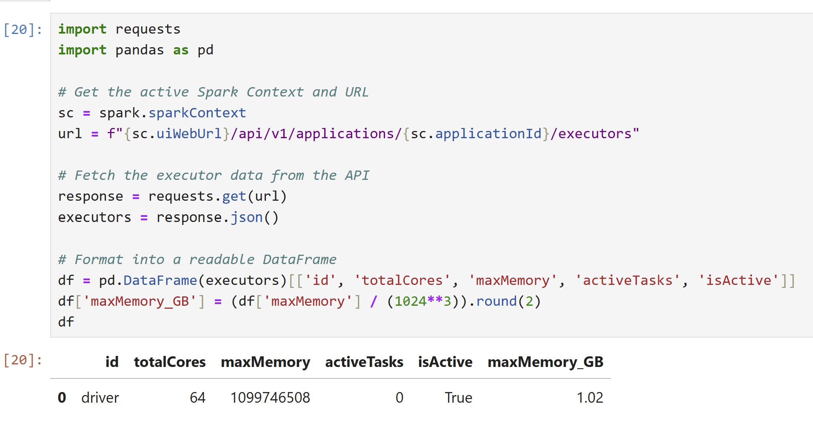
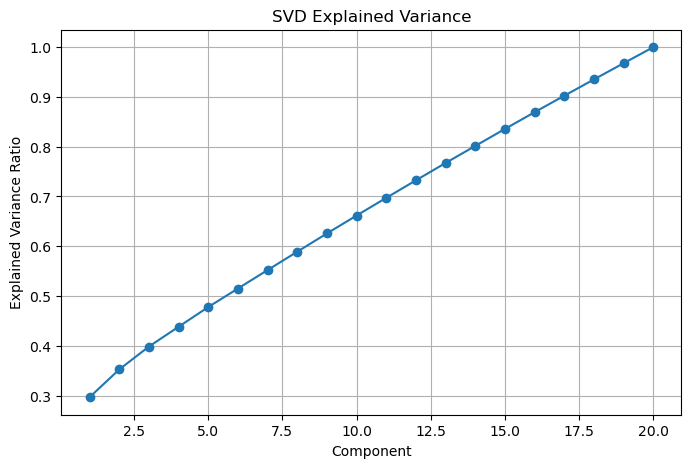
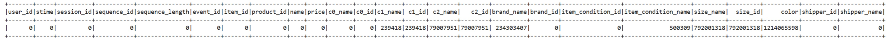

# Mercari Purchase Prediction Big Data Project

Anika Bhattacharya  
Travis Gillespie  
Marty Yossifov  
William Zou

DSC232R

Professor Edwin Solares  
TA Nishanth Ramesha

## Project Links

[https://huggingface.co/datasets/mercari-us/merrec](https://huggingface.co/datasets/mercari-us/merrec)

[Milestone4_part1.ipynb](Milestone4_part1.ipynb)
[Milestone4_part2.ipynb](Milestone4_part2.ipynb)

## Introduction

This project uses the Mercari MerRec dataset to predict whether a user action would lead to `buy_comp` (purchase [1] or non-purchase [0]). This project was chosen because online marketplaces contain a large amount of user interaction data, and predicting purchase behavior can help explain which actions and item features are associated with stronger purchase intent.

A good predictive model is interesting and important because it could help a marketplace better understand user behavior, improve recommendations, and identify which interactions are more likely to lead to completed purchases. Since most users browse or like items without purchasing, a model that can separate purchase behavior from non-purchase behavior has broader impact for recommendation systems, marketplace design, and conversion prediction.

This problem required big data and distributed computing because the data set being used is 166gb and there are 1,268,092,738 observations in the training set. Without Spark/Ray and the SDSC Expanse environment, preprocessing, feature engineering, and model training would be impractical or impossible to run locally in a timely way.

## SDSC Expanse Environment Setup

1) We use the SDSC Expanse portal to launch a jupyter environment for running Spark workloads. The benefit is the HPC resources’ processing power over that of one’s local machine. We choose the following environment settings:  
   Partition: shared  
   Time limit: 180 minutes  
   Number of cores: 64  
   Memory required per node: 128 GB  
   Working Directory: home  
   Environment Modules to be loaded: singularitypro  
   Type: JupyterLab  
   Singularity Image File Location: \~/esolares/singularity\_images/spark\_py\_latest\_jupyter\_dsc232r.sif  
2) spark \= SparkSession.builder \\  
        .config("spark.driver.memory", "2g") \\  
        .config("spark.executor.memory", "2g") \\

     .config("spark.executor.instances", 63\) \\  
    .getOrCreate()  
Reasoning: The data set being used is 166gb so to speed up processing we use a relatively large number of cores for increased parallelism. As long as we avoid using memory intensive operations such as .collect() 128 gb of memory is enough to handle operations on a file this large without crashing because not all of it is on the RAM at any given point. 

3) Using Executor instances \= Total Cores \- 1 and Executor memory \= (Total Memory \- Driver Memory) / Executor Instances we get 63 executor instances \= 64-1 and executor memory \= (128-2)/63 \= \~2 GB.  
4) 

```python
spark = SparkSession.builder \
    .config("spark.driver.memory", "2g") \
    .config("spark.executor.memory", "2g") \
    .config("spark.executor.instances", 63) \
    .getOrCreate()
```

## Figures

**Figure 1**  


**Figure 2**  


**Figure 3**  


**Figure 4**  


**Figure 5**




## Methods

### Data Exploration

There are 1,268,092,738 observations in the training set.

**User\_id** (categorical): Integer that identifies a user, unique to every user.  
**Stime** (continuous): Timestamp(utc) indicating when an event occurred.  
**Session\_id** (categorical): 64 character string that identifies a user’s session, groups of events from a user in a short time period are grouped into a single session.  
**Sequence\_id** (categorical): String that represents an event’s date and which datashard it belongs to.  
**Sequence\_length** (categorical): Integer that denotes the number of events that happened within a session.  
**Event\_id** (categorical): String that indicates the type of event that occurred. Uses 6 possible string values (item\_view, item\_like, item\_comment, item\_add\_to\_cart, item\_purchase, item\_share) to represent what was the user’s event. Highly imbalanced towards item\_viewed and item\_liked. The target column of this dataset.  
**Item\_id** (categorical): Integer that represents an item ID unique to a single listing post.  
**Product\_id** (categorical): String that is the concatenation of a product’s brand ID and c2 ID.  
**Name** (text) : The product’s listing title, slightly right-skewed distribution.   
**Price** (continuous): Float that represents the price of the item listed is US Dollars, highly right-skewed distribution.  
**C0\_name** (low cardinality categorical): String that represents what broad category a listing’s product belongs to with 17 classes.    
**C0\_id** (low cardinality categorical): Integer representation of C0\_name classes.  
**C1\_name** (high cardinality categorical): String that narrows the listing’s description from the broad C0 classes.  
**C1\_id** (high cardinality categorical): Integer representation of C1\_name classes.  
**C2\_name** (high cardinality categorical): String that further narrows the product’s description from the C1 classes.  
**C2\_id** (high cardinality categorical): Integer representation of C2\_name classes.  
**Brand\_name** (categorical): String that is the text label for a listed item’s brand.  
**Brand\_id** (categorical): Integer representation of brand\_name that uniquely identifies it.  
**Item\_condition\_nam**e (categorical): String describing the item’s condition using one of five different categories (Good, New, Like new, Fair, Poor).  
**Item\_condition\_id** (categorical): Integer representation of Item\_condition\_name classes.  
**Size\_name** (categorical): String representing the size of the listed item. Imbalanced towards null values due to most items not having size information.  
**Size\_id** (categorical): Integer representation of size\_name. Imbalanced towards null values due to most items not having size information.  
**Color** (categorical): String describing the color of the list item. Imbalanced towards null values due to most items not having color information.  
**Shipper\_name** (categorical): String that has two classes (buyer, seller) that denotes which of the two pays for shipment.   
**Shipper\_id** (categorical): Integer representation of shipper\_name.

Yes, there are missing values in several of the columns/categories. The columns with missing data include: **brand\_name, size\_name, color, c1\_name, c2\_name, item\_condition\_name.** These missing entries likely happen because product listings are usually not fully populated by users, which causes missing fields.  


c1\_name & c1\_id have 239418 missing values  
c2\_name & c2\_name have 79007951 missing values  
brand\_name has 234303407 missing values  
size\_name & size\_id have 792001318 missing values  
color has 12140645598 missing values  
item\_condition\_name has 500309 missing values

There are no duplicates in the data; this confirmed by the research paper associated with the dataset; “the dataset, in addition to standard attributes like user\_id, item\_id, and session\_id, also incorporates unique features such as timestamped action types, detailed product taxonomy, and textual product attributes”. Because of the unique nature of the timestamp in stime, there is no possibility for a duplicate entry. Additionally, the paper also reviews the data cleaning and processing steps, explicitly removing duplicates: “Redundancy Reduction: To address the issue of repetitive actions within sequences, such as consecutive clicks on the same item, a deduplication process was applied. This step ensured that only unique consecutive interactions were retained, reducing redundancy and enhancing data conciseness.”

**Figure 1** is a histogram that shows the distribution of item prices across the dataset. The distribution is heavily skewed to the right, as most items are priced near $0 \- $50, with the most common price range being the lowest. The prices for items extend all the way up to $5000, showing the small amount of high-value items.

**Figure 2** is a bar chart that shows the count of each user interaction event type (**event\_id**) across the dataset. **item\_view** is by far the most common event, with over 1 billion occurrences, indicating that the majority of user interactions are just passively browsing, where users look/click on items, rather than acting on them. Item\_like is the second most frequent event, at around 180 million occurrences, showing that saving or favoriting an item is the next most common behavior. The following events, such as item\_add\_to\_cart\_tap (25 million), offer\_make (8 million), buy\_start (3 million), and buy\_comp (1 million), show a steep drop-off, which show that the vast majority of users browse rather than purchase or act on items.

**Figure 3** is a bar chart that shows the events broken down by the product category, stored in **c0\_name.** Women’s fashion is the highest populated category with over \~400 million events, nearly double the next category after, which is Toys & Collectibles at \~240 million. Men, Kids, Home, Electronics, and Beauty form a mid-tier cluster at about 80-120 million events each. Finally, categories like Handmade, Office, Arts & Crafts, Pet Supplies, Garden & Outdoor, Tools, all have low engagement, suggesting a lower amount of items are listed under these categories, as well as less engagement from the general population, suggesting niche audiences. The category imbalance means that any category-aware model will need to handle the underrepresented classes by possibly implementing stratification.

**Figure 4** is a line graph that plots the average rate of like events among like and view events relative to prices for the dataset’s listings that have been grouped into 10 dollar bins. This graph shows that there is an approximately exponential decay in like events relative to like and view events until about the 2000 dollar bin. After the 2000 dollar buck the graph has much more variance and doesn’t show much change in the like average as price increases. This is likely due to high price items being much less common than low price items making price buckets past 2000 dollars more vulnerable to randomness and noise.

**Figure 5** shows the explained variance from the SVD dimensionality reduction step. The plot shows how much information is captured by each reduced component, helping us understand whether the reduced feature space still preserves most of the important structure from the original features. Since the earlier components explain more variance, this supports using SVD to compress the dataset before applying additional modeling.

### Preprocessing using Spark

**Handling missing values:** we will assess missing values across all the columns in the MerRec dataset using Spark operations like .na.drop() and .describe(). For numeric fields, we intend to use median imputation to reduce the impact of outliers and for categorical fields, we plan to use a placeholder like “Unknown”.  
**Handling data imbalance:** We will likely have to undersample the common classes such as item\_viewed and item\_liked while oversampling the item\_purchase class to prevent models from ignoring the rarer classes and still getting high accuracy.  
**Transformations:** We will use feature engineering to create a day of the week variable from the stime variable to see if it is more predictive than just the date. The price variable will be scaled from 0 to 1 based on the minimum and maximum values of price. One hot encoding will be used to turn categorical variables with classes such as our target variable event into binary variables representing each class to make it readable and usable for machine learning.   
**Spark Operations:** We will load the data using spark.read.parquet() (or equivalent) with a predefined schema, then filter relevant interaction types using filter() and clean the data with dropna(), fillna(), and dropDuplicates(). To capture temporal user behavior, we will construct sequence-based features using window operations (Window.partitionBy().orderBy()), along with functions such as lag(), lead(), and withColumn(), and compute aggregates using groupBy().agg(). We will transform data using select(), cast(), and text processing (e.g., tokenization and TF-IDF) will be applied. Finally, we will optimize performance using repartition(), cache(), and broadcast() joins, and write the processed dataset using write.parquet() for efficient downstream modeling.

Preprocessing output:  
```text
+--------------------+----------------------+--------------------+-------------------+--------------------------------+-----+
|event_id            |c0_name               |c1_name             |item_condition_name|features                        |label|
+--------------------+----------------------+--------------------+-------------------+--------------------------------+-----+
|item_add_to_cart_tap|Handmade              |Patterns            |Good               |(307,[14,173,301],[1.0,1.0,1.0])|0.0  |
|item_add_to_cart_tap|Home                  |Artwork             |Like new           |(307,[7,74,303],[1.0,1.0,1.0])  |0.0  |
|item_add_to_cart_tap|Toys & Collectibles   |Trading Cards       |Good               |(307,[4,37,301],[1.0,1.0,1.0])  |0.0  |
|item_add_to_cart_tap|Vintage & collectibles|Supplies            |Like new           |(307,[10,72,303],[1.0,1.0,1.0]) |0.0  |
|item_add_to_cart_tap|Women                 |Athletic apparel    |Like new           |(307,[3,23,303],[1.0,1.0,1.0])  |0.0  |
|item_like           |Handmade              |Patterns            |Good               |(307,[14,173,301],[1.0,1.0,1.0])|0.0  |
|item_like           |Toys & Collectibles   |Arts & Crafts       |Like new           |(307,[4,75,303],[1.0,1.0,1.0])  |0.0  |
|item_like           |Toys & Collectibles   |Arts & Crafts       |New                |(307,[4,75,302],[1.0,1.0,1.0])  |0.0  |
|item_like           |Toys & Collectibles   |Sports Trading Cards|New                |(307,[4,44,302],[1.0,1.0,1.0])  |0.0  |
|item_like           |Toys & Collectibles   |Trading Cards       |Like new           |(307,[4,37,303],[1.0,1.0,1.0])  |0.0  |
+--------------------+----------------------+--------------------+-------------------+--------------------------------+-----+
only showing top 10 rows
```

### Model 1: First Distributed Model

For the first distributed model, we trained a Decision Tree Classifier to predict whether a user action would lead to buy\_comp (purchase \[1\] or non-purchase \[0\]). We use price-based and categorical features for our model, which achieved about 60% validation accuracy.

```python
from pyspark.ml.classification import DecisionTreeClassifier

# Representative model setup from the notebooks
DecisionTreeClassifier(
    maxDepth=10,
    featuresCol="features",
    labelCol="label",
    seed=42
)
```

A second Decision Tree was also trained with slightly more tuned hyperparameters.

```python
DecisionTreeClassifier(
    labelCol="label",
    featuresCol="features",
    maxDepth=10,
    minInstancesPerNode=20,
    impurity="entropy"
)
```

### Model 2: SVD Dimensionality Reduction, Clustering, and Supervised Model

For the second distributed model, we used dimensionality reduction before additional modeling. Specifically, we applied SVD to reduce the original high-dimensional feature space into 20 lower-dimensional components. This helped compress the feature representation while still preserving useful information for prediction. After dimensionality reduction, we applied K-Means clustering to the reduced features and also trained a Logistic Regression model using the SVD components.

```python
from pyspark.ml.feature import StandardScaler
from pyspark.mllib.linalg import Vectors
from pyspark.mllib.linalg.distributed import RowMatrix

standscaler = StandardScaler(
    inputCol="features_raw",
    outputCol="features_svd",
    withStd=True,
    withMean=False
)

ss_model = standscaler.fit(train_final)
train_final_sample = train_final.sample(False, 0.001, seed=42)
train_svd = ss_model.transform(train_final_sample)

vec_rows = train_svd.select('features_svd').rdd.map(
    lambda x: Vectors.fromML(x.features_svd)
)

matrix_svd = RowMatrix(vec_rows)
k = 20
svd = matrix_svd.computeSVD(k, computeU=True)
```

```python
from pyspark.ml.clustering import KMeans
from pyspark.ml.evaluation import ClusteringEvaluator

kmeans = KMeans(k=5, maxIter=10, featuresCol="features_svd")
kmeans_model = kmeans.fit(svd_df)
clustered_df = kmeans_model.transform(svd_df)

clustering_evaluator = ClusteringEvaluator(
    featuresCol="features_svd",
    predictionCol="prediction",
    metricName="silhouette"
)

silhouette = clustering_evaluator.evaluate(clustered_df)
```

```python
from pyspark.ml.classification import LogisticRegression
from pyspark.sql import functions as F

train_svd_weighted = train_svd.withColumn(
    'weight',
    F.when(F.col('label') == 1.0, 100).otherwise(1.0)
)

log_res = LogisticRegression(
    featuresCol='features_svd',
    labelCol='label',
    maxIter=1000,
    weightCol='weight'
)

lr_model = log_res.fit(train_svd_weighted)
```

## Results

### Data Exploration Results

The data exploration results are shown in the figures above. The key findings are that the data contains a very large number of observations, has missing values in several listing-related fields, has highly imbalanced event counts, and has a heavily right-skewed price distribution.

### Preprocessing Results

The preprocessing step produced Spark ML feature vectors and a binary label column. The feature vectors shown above have 307 dimensions before SVD dimensionality reduction.

### Model 1 Results

Validation Accuracy: 0.6002513107408748  
Training Accuracy: 0.6092216103586843  
Using the ground truth, which in the processed dataset is the label column in the training, test, and validation datagrames, we found the accuracy score of our first model on the validation and training data to be roughly equal.

Validation Accuracy: 0.6002513107408748  
Training Accuracy: 0.6092216103586843  
Since the validation accuracy and training accuracy are both low and roughly equal the model is underfitting the data. This implies that the model is too simple to detect the data’s predictive signals.

```text
+---------------+-----------------------------------------------------+------------------+------------------+
|Model          |Hyperparameters                                      |Train Accuracy    |Test Accuracy     |
+---------------+-----------------------------------------------------+------------------+------------------+
|Decision Tree 1|maxDepth=10                                          |0.6092216103586843|0.6002513107408748|
|Decision Tree 2|maxDepth=10, minInstancesPerNode=20, impurity=entropy|0.608191695192737 |0.6242779303771513|
+---------------+-----------------------------------------------------+------------------+------------------+
```

The second model with slightly more tuned hyperparameters performs slightly better than the first decision tree classifier model. However, the improvement is only about 2 percent and is still lower than we would like.

Decision tree 2 preforms the best but the improvement in marginal. The marginal improvement is likely due using the entropy splitting criterion which is much better at dealing with imbalanced class distributions when compared to the default gini splitting criterion.

### Model 2 Results

The SVD results showed that the first component explained a large portion of the variance, while the full set of retained components captured the reduced feature space used for modeling. The clustering results were less meaningful, since the silhouette score was very close to 0. This suggests that the reduced features did not form clearly separated natural clusters. However, the supervised Logistic Regression model trained on the SVD-reduced features performed very well, achieving about 99% accuracy on both the training and test datasets.

Explained variance analysis from the SVD model:

```text
Component 1: 0.2966
Component 2: 0.0558
Component 3: 0.0460
Component 4: 0.0398
Component 5: 0.0396
Component 6: 0.0373
Component 7: 0.0371
Component 8: 0.0368
Component 9: 0.0367
Component 10: 0.0361
Component 11: 0.0355
Component 12: 0.0352
Component 13: 0.0349
Component 14: 0.0343
Component 15: 0.0341
Component 16: 0.0337
Component 17: 0.0331
Component 18: 0.0328
Component 19: 0.0325
Component 20: 0.0322
```

Cumulative explained variance:

```text
First 1 Components: 0.2966
First 2 Components: 0.3524
First 3 Components: 0.3984
First 4 Components: 0.4382
First 5 Components: 0.4778
First 6 Components: 0.5151
First 7 Components: 0.5522
First 8 Components: 0.5890
First 9 Components: 0.6257
First 10 Components: 0.6617
First 11 Components: 0.6973
First 12 Components: 0.7325
First 13 Components: 0.7673
First 14 Components: 0.8016
First 15 Components: 0.8357
First 16 Components: 0.8694
First 17 Components: 0.9025
First 18 Components: 0.9352
First 19 Components: 0.9678
First 20 Components: 1.0000
```

Clustering Quality:  
Silhouette Score: 0.009213161059956404

SVD Logistic Regression Training Accuracy:  
LR + SVD Training Accuracy: 0.9944725311762723

SVD Logistic Regression Test Accuracy:  
LR + SVD Test Accuracy: 0.9943091306714121

Train-test accuracy gap:  
0.00016340050486018942

## Discussion

The first Decision Tree model produced about 60% validation accuracy. This result is believable because a single Decision Tree is a relatively simple model, and user purchase behavior is complex. The training and validation accuracies were also close together, which suggests that the model was not overfitting. Instead, the model was likely underfitting because it could not capture enough of the relationships between price, item category, user behavior, and purchase outcome. The prediction results for the first model also showed important limitations. The model produced many false positives and false negatives, which means it had trouble separating true purchase intent from ordinary browsing behavior. When the threshold was adjusted, the model caught more true purchases and reduced false negatives, but it also increased false positives. This shows that the model’s usefulness depends on the goal. If the goal is to avoid missing potential buyers, the adjusted threshold may be better. If the goal is to avoid incorrectly targeting non-buyers, then the high number of false positives is a weakness.

The second model used SVD dimensionality reduction before training Logistic Regression. This model produced much higher accuracy than the Decision Tree model. One interpretation is that SVD helped compress the original feature space into a smaller set of components that preserved useful signal while reducing noise. This may have made the data easier for Logistic Regression to model. However, the second model’s very high accuracy should be treated cautiously. Because the dataset is highly imbalanced, 99% accuracy may be too good to trust without more evidence. It is possible that the model performed extremely well on the majority non-purchase class while still not being as strong on the minority purchase class. To fully believe this result, we would need to examine precision, recall, F1-score, AUC, and a confusion matrix for the SVD + Logistic Regression model. 

The clustering portion of the second model was less convincing. The K-Means silhouette score was close to 0, which means the reduced features did not form clear natural clusters. This suggests that unsupervised clustering was not very effective for separating purchase and non-purchase behavior. The SVD features appeared to be more useful for supervised prediction than for discovering natural groups. One shortcoming of the project was that sampling was necessary to make the analysis computationally manageable. While sampling helped the project run within the available Spark/HPC resources, it could've have removed some patterns from the full dataset.

## Predictions Analysis

We analyzed the model’s predictions by looking at correct classifications, false positives, and false negatives from the validation/test data. This was important because the dataset is highly imbalanced, with non-purchase events being much more common than purchase events. For the Decision Tree model, the validation results included 10,264 true positives, 11,410,504 true negatives, 7,599,186 false positives, and 6,690 false negatives. This means the model correctly identified some completed purchases, but it also predicted many non-purchase events as purchases. In this context, false positives represent users who were predicted to complete a purchase but did not, while false negatives represent actual purchases that the model missed. After adjusting the threshold, the model produced 13,256 true positives, 7,703,606 true negatives, 11,306,084 false positives, and 3,698 false negatives. This reduced the number of missed purchases, but it also increased the number of false positives. Therefore, the threshold-adjusted model became more aggressive in predicting purchases. For the SVD + Logistic Regression model, the final accuracy was much higher, with about 99% accuracy on both training and test data. However, because of the class imbalance, accuracy alone may not fully explain performance. Future prediction analysis should include a full confusion matrix, precision, recall, F1-score, and AUC for the reduced-feature model.

## Speedup Analysis


### Baseline Measurement


### Scaled Measurement


### Calculate Metrics


### Amdahl's Law Analysis


# Conclusion

### Model 1 Conclusion

For the first distributed model, we trained a Decision Tree Classifier to predict whether a user action would lead to buy\_comp (purchase \[1\] or non-purchase \[0\]). We use price-based and categorical features for our model, which achieved about 60% validation accuracy. This is better than random guessing for a binary classification task like buy\_comp, so it provides a useful baseline for predicting purchases, but better tuning or stronger models would most likely be needed to improve performance.

Indeed, a potential improvement for our model is testing different hyperparameters like the depth of the tree. For instance, a deeper tree could capture more complex relationships in the data, but it could produce overfitting. Beyond this improvement, we could also try different, more sophisticated, models like Random Forests. This could help because a single tree can be too simple since it’s overly relied upon to make predictions. Having a forest combines predictions from many trees which can produce better accuracy. Gradient Boosted trees are another great alternative since they have trees built sequentially in order to improve accuracy.

Distributed computing helped process this large dataset because Spark distributed the preprocessing steps as well as model training across workers. This reduces computation time to the point where we can make use of the SDSC clusters and Apache Spark in order to run this analysis in a timely way (if at all, since this would very unlikely be possible to run locally).  

### Model 2 Conclusion

For the second distributed model, we used dimensionality reduction before additional modeling. Specifically, we applied SVD to reduce the original high-dimensional feature space into 20 lower-dimensional components. This helped compress the feature representation while still preserving useful information for prediction. After dimensionality reduction, we applied K-Means clustering to the reduced features and also trained a Logistic Regression model using the SVD components.

The SVD results showed that the first component explained a large portion of the variance, while the full set of retained components captured the reduced feature space used for modeling. The clustering results were less meaningful, since the silhouette score was very close to 0. This suggests that the reduced features did not form clearly separated natural clusters. However, the supervised Logistic Regression model trained on the SVD-reduced features performed very well, achieving about 99% accuracy on both the training and test datasets.

Compared to the first Decision Tree model, the dimensionality reduction approach produced a much stronger supervised result. The small gap between training and test accuracy suggests that the model did not obviously overfit based on accuracy alone. However, because the dataset is highly imbalanced, this result should be interpreted carefully. Accuracy may not fully show how well the model predicts the minority purchase class. A future improvement would be to evaluate this model using precision, recall, F1-score, AUC, and a full confusion matrix.

### Overall Conclusion

Overall, this project showed the difficulty and value of predicting purchase behavior from large-scale user interaction data. The first model, a distributed Decision Tree Classifier, provided a useful baseline with about 60% validation accuracy. It showed that price-based and categorical features contained some predictive signal, but a single tree was likely too simple to fully capture the complexity of user behavior in the Mercari dataset.

The second model improved on this by adding dimensionality reduction with SVD before additional modeling. The reduced feature representation made the data more compact and allowed Logistic Regression to achieve much higher accuracy than the original Decision Tree model. This suggests that dimensionality reduction helped preserve the most useful structure in the data while removing unnecessary complexity from the feature space.

The main limitation of the project is that the dataset is highly imbalanced, with purchase events being much rarer than non-purchase events. Because of this, accuracy alone is not enough to fully judge model quality. Future work should focus more on precision, recall, F1-score, AUC, threshold tuning, and better handling of class imbalance. Additional models such as Random Forests, Gradient-Boosted Trees, or regularized Logistic Regression with different SVD component counts could also be explored.

This project also demonstrated the importance of big data and distributed computing. The Mercari dataset was far too large to handle efficiently on a local machine, so Spark and the SDSC Expanse environment were necessary for loading, preprocessing, transforming, and modeling the data.
